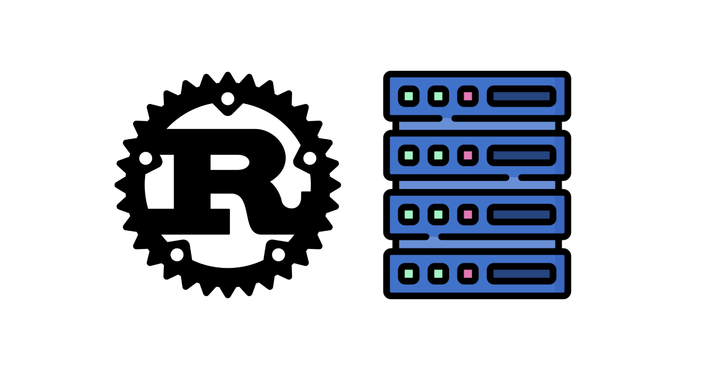

# Rust Live Server



A blazing-fast, zero-config, live-reloading development server written in pure Rust — serve static sites, auto-inject reload scripts, and watch file changes instantly.

> Inspired by tools like `live-server`, but built with performance, safety, and CLI flexibility in mind.

## Features

- **Serve any static folder** (HTML/CSS/JS)
- **Live reload on file change**
- **Smart script injection** (no manual setup needed)
- **Auto-reconnect** (reloads the page when the server restarts)
- **Custom host/port support**
- Built with safe, idiomatic Rust

## Getting Started

### 1. Clone the Repo

```bash
git clone https://github.com/kartikmehta8/rust-live-server.git
cd rust-live-server
```

### 2. Build the Project

```bash
cargo build --release
```

### 3. Run the Dev Server

```bash
./target/release/dev_server --dir ./client --port 9000 --host 127.0.0.1
```

- `--dir` → directory to serve
- `--port` → port to run on (default: 8080)
- `--host` → host (use `0.0.0.0` to access from other devices)

## Folder Structure

```
rust-dev-server/
├── src/
│   ├── main.rs              # CLI entrypoint.
│   ├── server.rs            # Axum server, routes, HTML injection.
│   └── watcher.rs           # File change detection using notify.
├── client/
│   ├── index.html           # Starter UI.
│   ├── styles.css
│   └── index.js
├── Cargo.toml
└── README.md
```

## Accessing from Another Device (LAN)

Run using:

```bash
./target/release/dev_server --dir ./client --port 9000 --host 0.0.0.0
```

Then visit:

```
http://<your-local-ip>:9000
```

Works on mobile/tablets over same WiFi.

## Customization

### Change default host/port:

```bash
./dev_server --port 3000 --host 0.0.0.0
```

### Modify injected live reload script:

`inject_reload_script()` in `server.rs` dynamically injects:

```html
<script>
  let first = true;
  const connect = () => {
    const ws = new WebSocket(`ws://${location.hostname}:${port}/livereload`);
    ws.onopen = () => {
      if (!first) window.location.reload();
      first = false;
    };
    ws.onmessage = () => window.location.reload();
    ws.onclose = () => setTimeout(connect, 500);
  };
  connect();
</script>
```

### Use globally

1. Install globally (from the repo dir):

```bash
cargo install --path . --locked
```

This compiles and copies the binary to `~/.cargo/bin/dev_server`.

2. Use from anywhere:

```bash
cd ~/some/project
dev_server            # serves the current directory on 127.0.0.1:8080
dev_server -p 9000    # custom port
```

3. Update later after source changes

```bash
cargo install --path . --locked --force
```


## Tips

- Supports any static file: `.html`, `.css`, `.js`, `.png`, etc.
- No need to write the reload script — it’s injected automatically.
- Add your own middleware by editing `server.rs`
- Fast rebuilds with `cargo watch -x run`

## Built With

- [Rust](https://www.rust-lang.org/)
- [axum](https://docs.rs/axum)
- [notify](https://docs.rs/notify) (with a custom debounce loop)
- [tokio](https://tokio.rs/)
- `cargo` for package and CLI management


<h3>
  <p align="center">
    Made with ❤️ by <a href="https://mrmehta.in">kartikmehta8</a>
  </p>
</h3>
